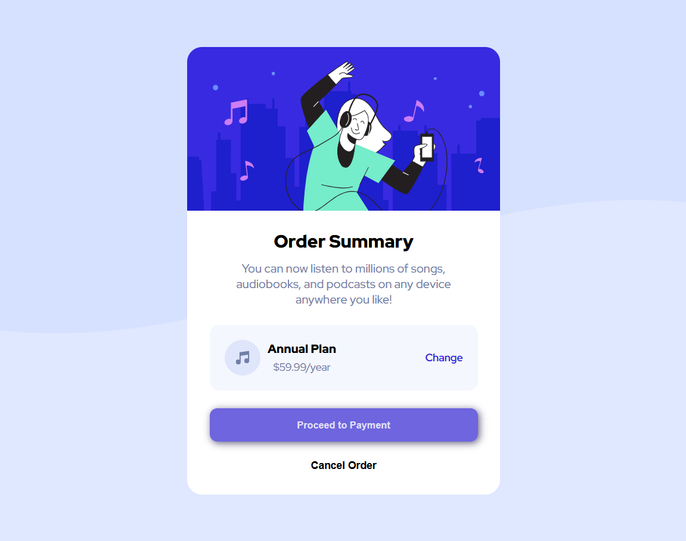

# 🎵 Order Summary

A clean and interactive order summary card component project inspired by real-world checkout interfaces. This project focuses on building accessible, structured content blocks with modern color contrast, responsive padding, and polished active-state button interactions.

## ✨ What this project does

This project demonstrates:

- clean card layout design
- structured HTML alignment
- modern interactive state transitions
- responsive layout for mobile and desktop screens
- typography and alignment positioning techniques

## 🎨 Design concept

the page presents an interactive checkout step:

- 🎵 Keep It Musical
- 💳 Keep It Accessible
- 🚀 Keep It Clean

Each element uses its own visual identity and a clear call to action button to make the design feel lively and polished.

## ✨ Main features

- 📦 Clean card structure
- 🔗 Responsive flex positioning
- ⚡ Hover micro-interactions on links and buttons
- 🎨 Consistent branding palette
- 📐 Centered viewport alignment

## 📷 Screenshot

## 🔍 Project Overview

This project was created as a layout practice exercise focused on building a modern payment confirmation component with visually distinct text weights and clear primary actions. It highlights how structure, spacing, and subtle shadows can shape a strong user experience.

## 💡 What I Learned

- how to structure interactive components into clean, semantic sections
- how to use Flexbox margin rules (`margin-left: auto`) to cleanly space children
- how to handle viewports using `min-height: 100vh` to anchor designs perfectly
- how to build polished, interactive button hover transitions with simple HTML and CSS

## 🚀 How to run

1. Open the project folder in VS Code.
2. Open [Order_Summary/index.html](Order_Summary/index.html).
3. Use Live Server or open the file directly in your browser.

## 🛠️ Technologies used

- HTML
- CSS

## 📁 Project structure

- index.html - page content and card structure
- style.css - visual styling, hover animations, and layout

## 🚀 Future ideas

You can expand this project by adding:

- interactive selection checkmarks when clicking the plan
- fully responsive modal slide-ins for mobile viewports
- dynamic payment type options (PayPal, Apple Pay)
- dark mode theme switching toggle
- animated loading screen states when clicking proceed

## 👤 Author

A simple front-end design project for practicing layout and styling.
